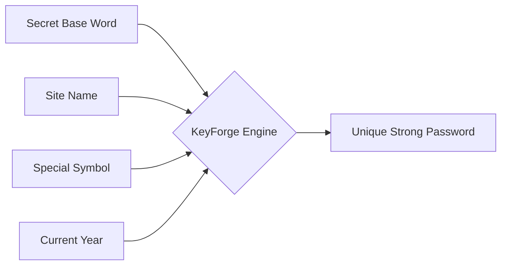

<div align="center">

<!-- Animated Header -->


<!-- Multi-Line Typing SVG -->


<br>

<!-- Themed Shields.io Badges -->
[](https://github.com/SudhirDevOps1)
[](https://github.com/SudhirDevOps1)
[](https://github.com/SudhirDevOps1)
[](https://github.com/SudhirDevOps1)

<br>

<!-- Tech Stack Icons -->


<br>


</div>

## 🛡️ The Mission: KeyForge Pro v3.0
Developed by **Sudhir Kumar (@SudhirDevOps1)**, **KeyForge Pro** is a world-class, 100% offline password management and generation ecosystem. Unlike traditional managers, it combines a **Smart Formula Logic** with **Military-Grade AES-256-GCM Encryption** to ensure your credentials are both memorable and mathematically unbreakable.

> [!IMPORTANT]
> **Zero Data Leakage:** This application runs entirely in your browser. No data ever touches a server. Your Master Key is never stored—only its SHA-256 hash exists locally for verification.

---

## 🧠 The Smart Formula Mental Model
The core philosophy of KeyForge is that you shouldn't have to remember 100 random strings. Instead, you remember **one Secret Base Word** and apply the formula.

### 🔄 The Logic Flow


### 📋 Formula Example
| Input Component | Value | Resulting Password |
| :--- | :--- | :--- |
| **Base Word** | `Kitab` | |
| **Site** | `Instagram` | |
| **Separator** | `-` | **`Kitab-Insta@2026`** |
| **Symbol** | `@` | |
| **Year** | `2026` | |

---

## 🛠️ Technical Deep-Dive

### 🔐 Cryptographic Architecture
KeyForge Pro v3.0 utilizes the native **Web Crypto API** for high-performance, secure operations.

1.  **Key Derivation:** Uses **PBKDF2** (Password-Based Key Derivation Function 2) with **100,000 iterations** of SHA-256 to turn your Master Key into a 256-bit encryption key.
2.  **Encryption:** Uses **AES-256-GCM** (Galois/Counter Mode), providing both confidentiality and authenticity (AEAD).
3.  **Unique IVs:** Every export generates a fresh **Initialization Vector (IV)** and **Salt**, ensuring that even identical vaults result in different encrypted blobs.

### 🔍 Code Analysis: Encryption Engine
```javascript
async function encryptData(data, password) {
    const salt = crypto.getRandomValues(new Uint8Array(16)); // Random Salt
    const iv = crypto.getRandomValues(new Uint8Array(12));   // Unique IV for GCM
    const key = await deriveKey(password, salt);            // PBKDF2 Derivation
    const enc = new TextEncoder();
    const encrypted = await crypto.subtle.encrypt(
        { name:'AES-GCM', iv }, 
        key, 
        enc.encode(JSON.stringify(data))
    );
    // Returns a secure, self-contained encrypted object
}
```

---

## 🚀 Key Features

### 1️⃣ Triple-Threat Generator
*   **Formula Gen:** Strategic passwords based on your secret base word.
*   **Passphrase Gen:** Uses an EFF-inspired wordlist of 350+ words for human-readable security.
*   **Random Gen:** Pure cryptographic randomness for maximum entropy.

### 2️⃣ The Vault & Security
*   **Auto-Lock:** Vault automatically locks after 15 minutes of inactivity.
*   **Categories:** Organize by Social, Finance, Dev, Gaming, etc.
*   **Strength Analyzer:** Real-time entropy calculation and "Time-to-Crack" estimation.

### 3️⃣ Data Portability
*   **Encrypted JSON:** Export your entire vault as an AES-256-GCM encrypted file.
*   **CSV Support:** Standard format for legacy spreadsheet backups.
*   **Merge/Replace:** Intelligently import data without losing current entries.

---

## 🎮 Keyboard Shortcuts (Power User Mode)

| Action | Shortcut |
| :--- | :--- |
| **Lock Vault** | `Ctrl + L` |
| **Copy Last Password** | `Ctrl + Shift + C` |
| **Generate New Random** | `Ctrl + Shift + G` |
| **Open History** | `Ctrl + H` |
| **Switch Tabs** | `Alt + [1-6]` |
| **Close Modals** | `Esc` |

---

## 🏗️ Technical Stack
> [!TIP]
> This project is a "Single File Application"—everything is bundled in one HTML file for maximum portability.

*   **Frontend:** [Tailwind CSS v4.0](https://tailwindcss.com/)
*   **Typography:** Inter & JetBrains Mono (via Google Fonts)
*   **Icons:** HeroIcons & Custom SVG
*   **Storage:** Browser LocalStorage (Encrypted on Export)
*   **Security:** Web Crypto API

---

## 🚧 Challenges for Learners
1.  **Persistence Challenge:** Modify the code to support a "Local File System Access API" to auto-save the encrypted JSON to a local folder.
2.  **Security Challenge:** Implement a "Duress Password" that clears the LocalStorage if entered in the lock screen.
3.  **UI Challenge:** Add a "Dark/Light/Cyberpunk" theme switcher using Tailwind CSS variables.

---

<div align="center">


### 🤝 Connect with the Developer
**Sudhir Kumar**
*GitHub: [@SudhirDevOps1](https://github.com/SudhirDevOps1)*

**Version 3.0 — "The Encrypted Edition"**
*Made with ❤️ for the Privacy Community*

</div>
